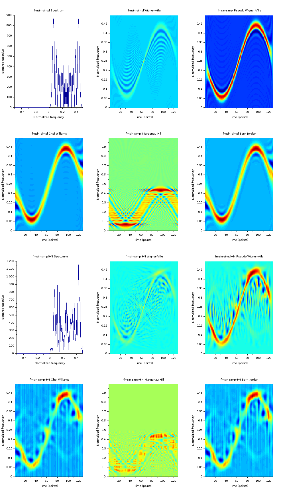

# Space-time analysis of stochastic structures
## Content
### stochastic_fm.sci
Frequency modulation of signals:

1. fmconst — Signal with constant frequency modulation,
2. fmhyp — Signal with hyperbolic frequency modulation,
3. fmlin — Signal with linear frequency modulation,
4. fmodany — Signal with arbitrary frequency modulation,
5. fmpar — Parabolic frequency modulated signal,
6. fmpower — Signal with power-law frequency modulation,
7. fmsin — Signal with sinusoidal frequency modulation,
8. gdpower — Signal with power-law group delay.

### stochastic_synthesis.sci
1. Synthesis of a mono-component non stationary signal
2. Multi-component non stationary signals 

###

## udes tools:
### scilab-6.0.2
cross-platform numerical computational package \
https://www.scilab.org/download/6.0.2

### Time Frequency Toolbox
Version: 2.0.2 \
https://atoms.scilab.org/toolboxes/stftb

## Example of the resulting graph

